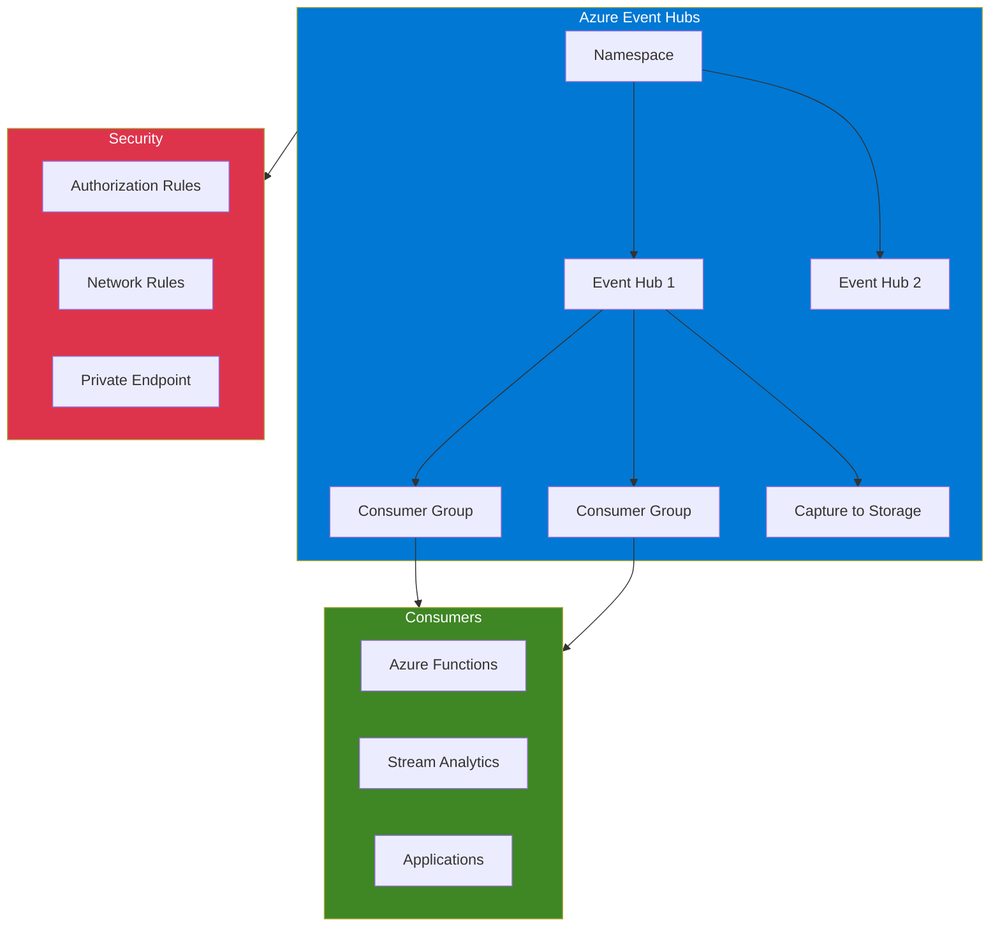

# terraform-azure-event-hub

Terraform module for Azure Event Hubs with namespaces, event hubs, consumer groups, authorization rules, capture, and network rules.

## Architecture



## Usage

```hcl
module "event_hub" {
  source = "github.com/kogunlowo123/terraform-azure-event-hub"

  namespace_name      = "my-eventhub-ns"
  resource_group_name = "rg-eventhub"
  location            = "East US"
  sku                 = "Standard"

  event_hubs = {
    orders = {
      partition_count   = 4
      message_retention = 7
    }
  }

  tags = { Environment = "production" }
}
```

## Requirements

| Name | Version |
|------|---------|
| terraform | >= 1.5.0 |
| azurerm | >= 3.80.0 |

## License

MIT Licensed. See [LICENSE](LICENSE) for details.
